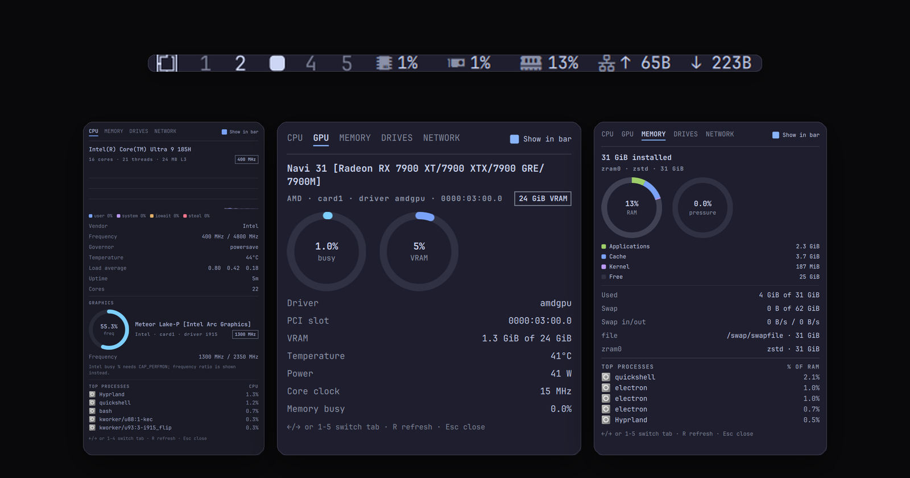
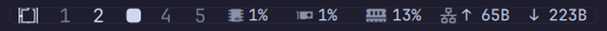
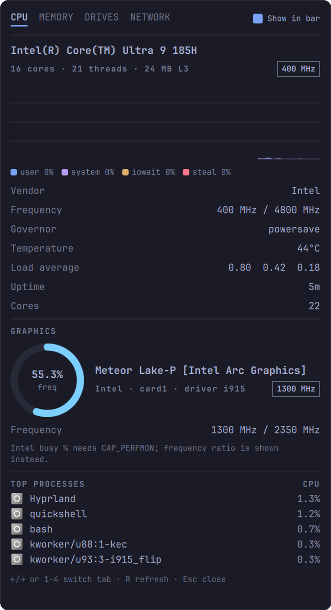
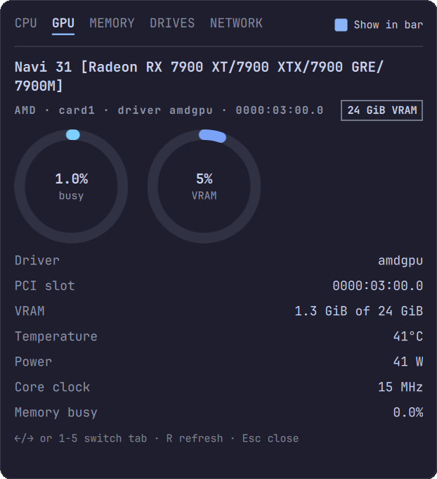
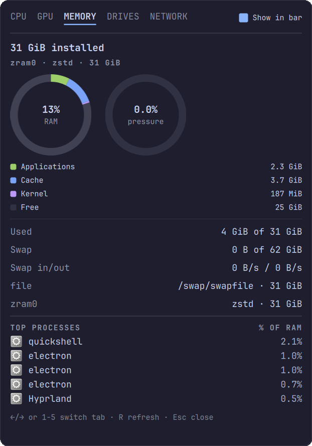
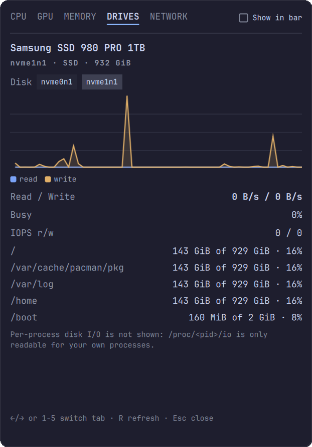
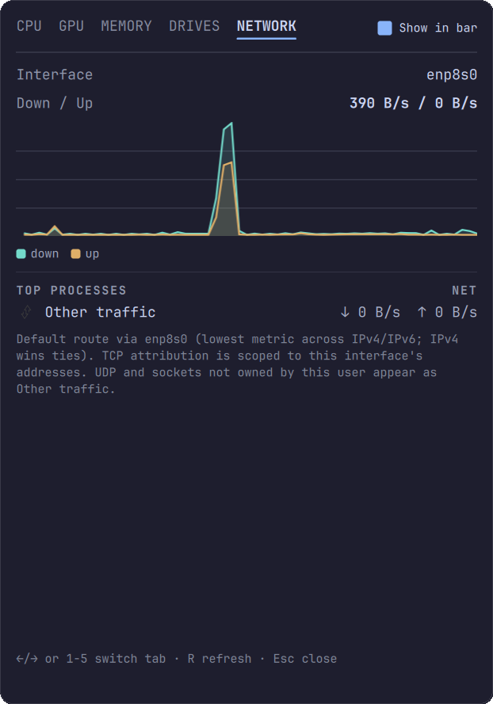

# Quadrant

<p align="center">
  
</p>

A unified system monitor for the Omarchy Quattro bar: CPU, GPU, memory, and
network in one compact bar widget and one tabbed panel — plus a Drives tab.
The disk bar segment is off by default when a dedicated GPU is present; on
iGPU-only machines it fills the GPU slot instead. Per-process disk
attribution is not available.
Each panel tab identifies the hardware it is measuring — CPU model and topology,
GPU name and driver, installed RAM and swap devices, block devices and
mounts — then shows live usage.

<p align="center">
  
</p>

Clicking a segment opens the panel on that segment's tab; clicking anywhere
else toggles the panel on the last-used tab.

<p align="center">
  
  
</p>
<p align="center">
  
  
</p>
<p align="center">
  
</p>

Built against the documented Quattro plugin contract. Supports **Omarchy 4**
(the Quattro shell). Requires `bash` ≥ 5, `jq`, `ps` (procps), `ss`
(iproute2), `df` (coreutils), and `awk` (mawk or gawk); `nvidia-smi` only if you have an
NVIDIA card; `lspci` (pciutils) is optional and used to name AMD/Intel
GPUs.

## Install

Quadrant is a third-party plugin and runs unsandboxed with your user
permissions. Review the repository before enabling it.

### From the Omarchy menu

1. Open the Omarchy menu.
2. Choose **Setup → Plugins → Add**.
3. Enter:

   ```text
   https://github.com/BVisagie/omarchy-quadrant.git
   ```

4. Read and accept Omarchy's plugin warning, then choose whether to enable
   Quadrant.

The Add action opens a terminal so the warning, confirmation, and install
output remain visible.

### From a terminal

```sh
omarchy plugin add https://github.com/BVisagie/omarchy-quadrant.git
```

Without `--enable`, Omarchy asks whether to enable the plugin after cloning
and validating it. Choosing no lets you inspect the installed checkout at
`~/.config/omarchy/plugins/dev.bvisagie.quadrant/` first. Enable it later
with:

```sh
omarchy plugin enable dev.bvisagie.quadrant
```

The widget starts in the right bar section (`barWidget.defaultSection`).
Move it with `omarchy bar move dev.bvisagie.quadrant --section center`.

### Update

```sh
omarchy plugin update dev.bvisagie.quadrant
```

Omarchy shows the incoming diff, validates the revision, and only then
fast-forwards the installed checkout.

### Uninstall

From the Omarchy menu, choose **Setup → Plugins → Remove**, then select
**Quadrant**.

Or remove it from a terminal:

```sh
omarchy plugin remove dev.bvisagie.quadrant
```

Omarchy disables Quadrant before removing its git checkout. No sudo command
or manual deletion under `~/.config/omarchy/plugins/` is required.

## Usage

- **Bar segments**: CPU, GPU, memory, disk, and network each pair a Nerd Font
  glyph (or `C`/`G`/`M`/`D`/`N` with `barLabels letter`) with a live value
  on one line. Intel GPU prefixes `~` when the value is a frequency
  estimate. Network uses compact rates (`↑ 1.0K  ↓ 99K`) in a font-sized
  stable slot; vertical bars stack those rates on two lines and drop the
  glyphs. Each segment toggles independently; the slot shrinks to fit. Icon
  and value sit in a tight pair; neighbouring cells share one small gap
  rather than a divider, so the slot reads as one composition. The GPU
  segment and tab are **dedicated cards only** — integrated graphics live
  on the CPU tab. When no dedicated GPU is detected, the default `gpu`
  token is shown as **Drives** (`diskFallbackWithoutGpu`, on by default)
  without rewriting `segments`. A **disk** segment is otherwise off by
  default so the slot stays compact on a crowded bar; enable it from the
  Drives tab's **Show in bar** checkbox or via `segments`. Unchecking
  every segment leaves a compact system-monitor glyph; clicking it still
  opens the full panel. Vertical bars are supported (segments stack;
  cells clamp to the 28 px slot and drop the glyph). Values at ≥90% load
  use the theme urgent color; `barPalette vivid` restores the original
  per-resource hues. `barLabels` is `glyph` (default), `letter`, or `none`.
- **Panel**: click the widget. `←`/`→` or `1`–`N` (N = visible tabs; GPU
  is omitted when no dedicated card is present) switch tabs, `R`
  refreshes the active tab and re-reads hardware identity, `Esc` closes. `Tab` keeps its Quattro meaning
  (switch to the adjacent bar panel) and is deliberately not used inside
  Quadrant. Each tab has a **Show in bar** checkbox (Drives off by default
  when a dedicated GPU is present) that persists the existing `segments`
  setting; hiding a segment never hides its tab.
- **IPC** (for scripts and keybinds):

```sh
quickshell ipc -p "$OMARCHY_PATH/shell" call dev.bvisagie.quadrant showTab gpu   # cpu | gpu | mem | disk | net
omarchy-shell shell summon dev.bvisagie.quadrant '{}'   # open on last-used tab
omarchy-shell shell hide dev.bvisagie.quadrant
```

## Settings

All settings live inline on the widget's entry in
`~/.config/omarchy/shell.json` and are declared in the manifest schema, so
`omarchy bar set` works:

```sh
omarchy bar set dev.bvisagie.quadrant processCount 8
omarchy bar set dev.bvisagie.quadrant networkInterface '"wg0"'
```

| Key | Default | Meaning |
| --- | --- | --- |
| `segments` | `["cpu","gpu","memory","network"]` | Which bar segments to show. `disk` is valid but off by default when a dedicated GPU is present. Each panel tab's **Show in bar** checkbox writes this list; an empty list shows a compact system-monitor icon. |
| `processCount` | `5` | Top-process rows per tab (1–10) |
| `barIntervalMs` | `1000` | Stream cadence feeding bar + history (250–60000) |
| `panelIntervalMs` | `2000` | On-demand sampler cadence while the panel is open (500–60000) |
| `networkInterface` | `"auto"` | `auto` = default route across IPv4 **and** IPv6, lowest metric wins, IPv4 takes ties |
| `gpuDevice` | `"auto"` | Dedicated GPU for the GPU segment and tab. `auto` = boot display card among dedicated GPUs when determinable, else `card0`; or a specific `cardN`. Integrated cards are not selected. |
| `integratedGpuDevice` | `"auto"` | Which card is integrated graphics on the CPU tab. `auto` = Intel at `00:02.x` or a known AMD APU name; `none` = treat every card as dedicated; or a specific `cardN`. |
| `diskFallbackWithoutGpu` | `true` | When no dedicated GPU is detected, show Drives in place of the configured `gpu` bar token without rewriting `segments`. |
| `diskDevice` | `"auto"` | `auto` = physical disk backing `/` (LUKS/LVM folded), else the largest whole device; or a sysfs name such as `nvme0n1` |
| `barPalette` | `"theme"` | `theme` = urgent color at ≥90% load; `vivid` = original per-resource hues |
| `barLabels` | `"glyph"` | `glyph` = Nerd Font icons; `letter` = C/G/M/D/N; `none` = value only |

## What it measures (and what it does not)

- **CPU**: user (incl. nice) and system (incl. irq/softirq) are stacked in
  the graph; `iowait` is its own series; `steal` is labeled separately and
  never folded into "system". The tab header is the `model name` from
  `/proc/cpuinfo` with physical cores / threads, L3 cache, scaling
  governor, and current/max frequency (`scaling_cur_freq` when present,
  else the cpuinfo snapshot). When an integrated GPU is present, a
  **GRAPHICS** block on this tab shows its identity and live frequency or
  busy metrics (sampled while the CPU tab is open).
- **Memory**: composition splits RAM into Applications / Kernel
  (unreclaimable slab) / Cache (page cache + **Buffers** + SReclaimable) /
  Free. The RAM ring is the primary gauge; the pressure ring is PSI memory
  `some avg10`. PSI is **optional per resource** — when `/proc/pressure/cpu`
  or `/proc/pressure/memory` is unreadable that half is JSON `null` and the
  ring shows `--`, not zero. The process column is "% of RAM". The tab
  header is installed RAM; swap devices
  from `/proc/swaps` are listed (zram includes the active compression
  algorithm and disk size).
- **GPU**: the GPU tab and bar segment cover **dedicated** cards only.
  AMD reads `amdgpu` sysfs (`gpu_busy_percent`, `mem_busy_percent`,
  per-engine `engine/*/busy_percent`, VRAM info, hwmon temp/power, active
  DPM sclk). NVIDIA runs `nvidia-smi` (timeout-bounded,
  row-capped) **only while the GPU segment or tab is visible** — never in
  the 1 Hz stream. Discrete Intel uses the same frequency-ratio estimate
  as the CPU-tab iGPU block. Intel i915 frequency files are read from the
  DRM card node as well as the PCI device node (and xe `tile*/gt*/freq0`).
  Integrated Intel (PCI `00:02.x`) and known AMD APUs appear on the CPU
  tab instead; `integratedGpuDevice` overrides that mapping. Multi-GPU
  systems get a dedicated-card selector in the GPU tab; the choice is
  persisted with `omarchy bar set … gpuDevice`. The tab header is the
  card's marketing name: NVIDIA's `nvidia-smi` name, or `lspci -D -mm`
  joined by PCI slot for AMD/Intel, falling back to vendor + PCI ID when
  pciutils is not installed. Driver and slot come from sysfs `uevent`.
  Per-process GPU attribution is v2.
- **Disk**: `/proc/diskstats` for whole block devices (`/sys/block/<name>`),
  excluding `loop*`, `ram*`, `zram*` (zram is on the Memory tab), `fd*`,
  `nbd*`, and `sr*`. Device-mapper (`dm-*`) and md RAID (`mdN`) with a
  **single** physical parent are folded onto that parent — LUKS root on
  `nvme0n1p2` is shown as `nvme0n1`, not as `dm-0`. RAID across two disks
  stays selectable as `md0`. Rates are 512-byte sectors on the physical
  (or unfolded) device; busy % is `io_ticks` over wall time. Capacity per
  mount comes from `df -P -B1 -T`, skipping virtual filesystems, and the
  Drives tab lists only mounts that resolve onto the selected disk.
  Device model and SSD/HDD come from sysfs; NVMe temperature is the
  `nvme` hwmon only — same whitelist rule as CPU temp, never a
  first-readable-sensor fallback. `auto` follows the disk backing `/`
  after that fold, else the largest whole device. A pinned name that is
  missing after remap shows **Pinned disk … is not available**; wrapping
  quotes from `omarchy bar set` are stripped on read. Per-process disk
  I/O is deferred: `/proc/<pid>/io` is only readable for your own
  processes, so a half-attributed list would lie. The disk **bar segment
  is off by default when a dedicated GPU is present**; on machines with
  only integrated graphics (or no GPU), Drives fills the vacant GPU slot
  unless `diskFallbackWithoutGpu` is turned off. Toggle it with **Show in
  bar** on the Drives tab.
- **Network**: rates for the selected interface plus 60s down/up history.
  Per-process attribution uses per-socket TCP byte counters from
  `ss -tinp`, scoped to the watched interface's addresses (ss is global;
  the byte counters are not). UDP, sockets on other interfaces, sockets
  owned by other users, and closed-socket remainders cannot be attributed
  — they appear as an honest **Other traffic** row (keyed on `pid == 0`; a
  process literally named "Other traffic" can never collide with it). The
  tab footer says **Default route via …** when the interface is auto-picked,
  or **Pinned interface …** when `networkInterface` is set.
- **Temperature**: hwmon whitelist only (`k10temp`, `coretemp`,
  `zenpower`, `cpu_thermal` for the CPU tab; `nvme` for the Drives tab).
  There is no first-readable-sensor fallback — Quadrant shows `--` rather
  than another chip's temperature.

## Security posture

Quadrant runs **unsandboxed inside `omarchy-shell` with your user
permissions** — the same model as every Quattro plugin. Concretely:

- **Read-only.** The plugin sends no signals to other processes and writes
  nothing outside a `mktemp -d` directory under `$XDG_RUNTIME_DIR` (a FIFO
  used as the sampler's tick clock, removed on exit). Process actions
  (terminate from the panel) are deferred to v2 behind an
  `allowProcessActions` setting that defaults off.
- **No secrets in process data.** Process lists read `ps -o comm=` — never
  `args`, never `/proc/*/cmdline`, never `environ`.
- **Injection-safe rendering.** Every `Text` element bound to script output
  or process names sets `textFormat: Text.PlainText` (Qt's default
  AutoText can interpret HTML-like strings, including inline images). CI
  enforces this with a check over all QML files. The bar tooltip is
  rates/percentages (never process comm) and is rendered by the shell's
  WidgetButton tooltip, which is already PlainText.
- **Safe transport.** Process names, firmware strings, PCI-DB names, and
  raw tool output travel as JSON strings built with `jq --arg` — never TSV
  through a name. The `ss` parser anchors on the kernel's trailing `pid=`
  field, so a forged process name cannot borrow another pid. `lspci -mm`
  is parsed in Model.js (fixture-tested), never concatenated in bash.
- **Exact-match icons.** Desktop-entry matching for process icons/names is
  exact-match only (normalized id, Name, Icon, `StartupWMClass`); the raw
  `comm` is always shown beside any friendly name.
- **Failures are visible.** A helper that exits non-zero or times out
  surfaces an error in the panel — never an empty list presented as "no
  activity". QML distinguishes `[]` + exit 0 from failure.
- **Hardened scripts.** `set -euo pipefail`, helpers resolved from
  `/usr/bin/<name>` first then `command -v`, quoted expansions, POSIX awk
  only (CI runs the suite under mawk **and** gawk).
- **Binaries invoked**: `bash`, `jq`, `ps`, `ss`, `ip`, `df`, `timeout`, `mktemp`,
  `mkfifo`, `nvidia-smi` (NVIDIA only, on demand), `lspci` (optional, one
  shot at startup / on R). No root, no setcap, no setuid, no daemons.

### Data layer

One long-lived sampler, `scripts/quadrant-stream`, emits one JSON line per
tick (CPU ticks, meminfo, PSI, vmstat swap counters, per-interface net
counters, per-disk diskstats, default routes, whitelisted CPU temp, cheap GPU
sysfs fields for a **dedicated** AMD/Intel card, optional `scaling_cur_freq`). It is a **single bash process with
zero fork/exec per tick** — timing comes from `read -t` on a self-held FIFO —
consumed in QML via `Process` + `SplitParser` with a restart timer. The
stream ships raw counters only; all deltas and rates are pure functions in
`Model.js`, tested with `node --test` against captured fixtures (including
hostile ones). Panel samplers (`process-cpu`, `process-memory`,
`process-net`, `gpu-stats`, `disk-info`) run on demand while the panel is
open, each with a kill watchdog. Integrated-GPU metrics use `gpu-stats sample`
while the CPU tab is open. Hardware identity (`scripts/system-info`)
runs once at startup and again when the user hits R — never on the 1 Hz
path. `disk-info` also runs at startup so the Drives tab has identity
before it is opened.

## Development

```sh
node --test tests/model.test.js          # pure-logic tests
bash tests/intel-freq-paths.sh           # Intel sysfs path lookup
shellcheck -x scripts/*                  # script lint (follows sourced helpers)
mawk -f tests/check-plaintext.awk BarWidget.qml Panel.qml tabs/*.qml components/*.qml
```

CI runs all of the above on every push, with the script smoke tests and the
PlainText check under both mawk and gawk.

Pre-publish gate (needs an Omarchy install):

```sh
omarchy plugin validate /path/to/omarchy-quadrant
qmllint -I "$OMARCHY_PATH/shell" /path/to/omarchy-quadrant/BarWidget.qml /path/to/omarchy-quadrant/Panel.qml
```

Manual test matrix before publishing: AMD / NVIDIA / Intel dedicated,
Intel or AMD iGPU-only, hybrid iGPU+dGPU, no-GPU,
IPv6-only network, swapless machine, vertical bar, both mawk and gawk as
`awk`, spinning disk and multi-filesystem machines.

## License

MIT — see [LICENSE](LICENSE).
