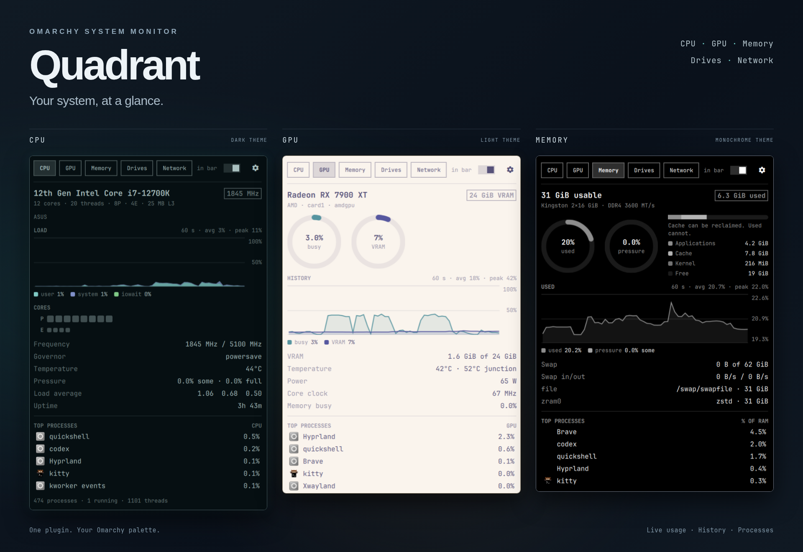
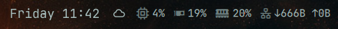
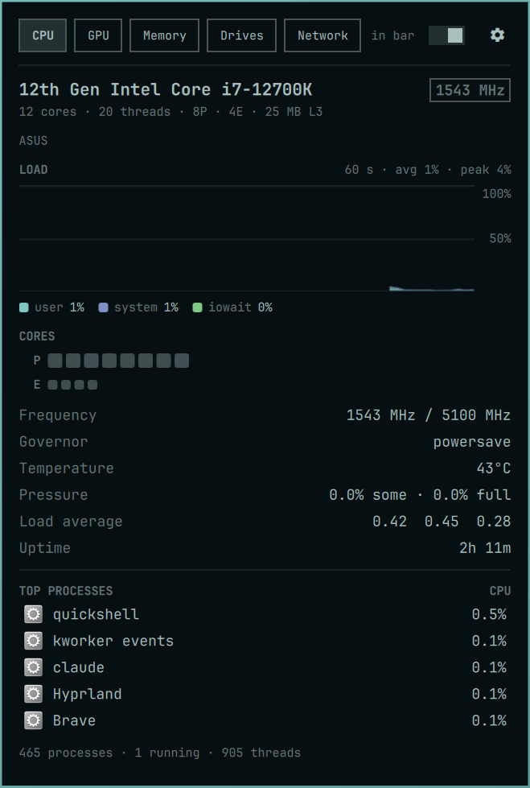
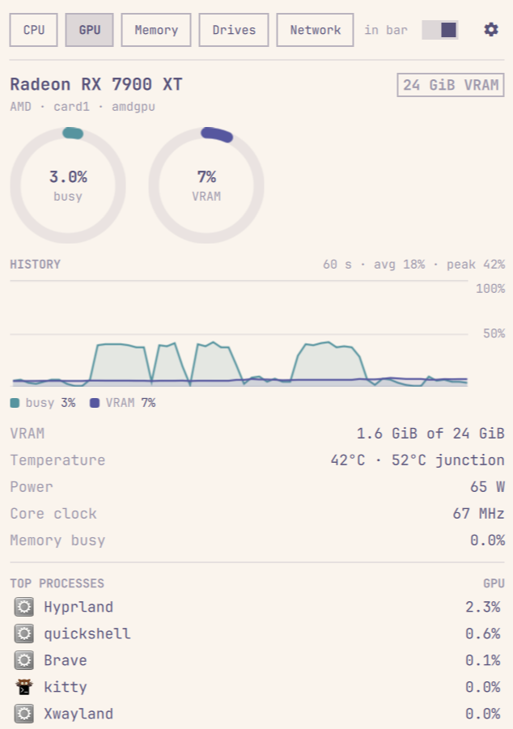
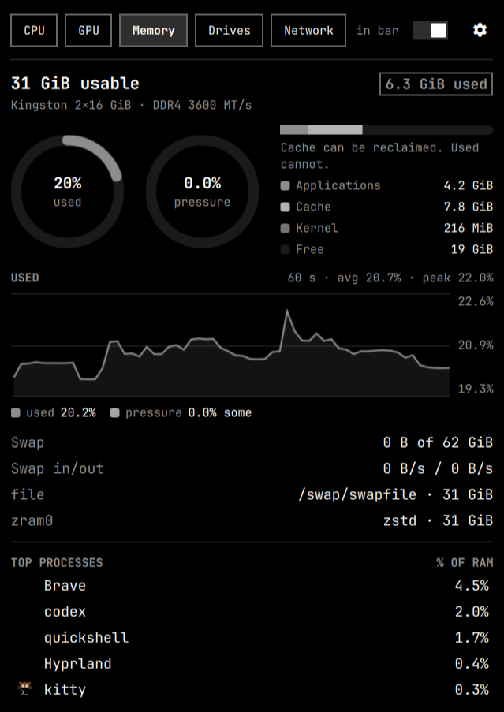
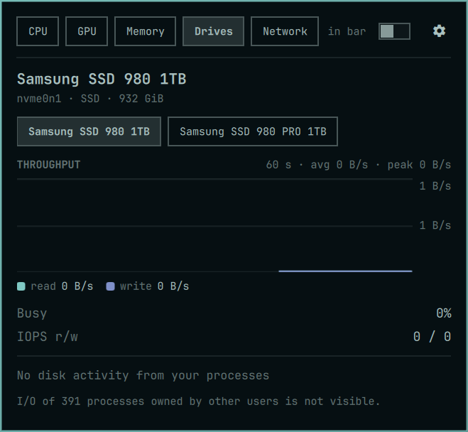
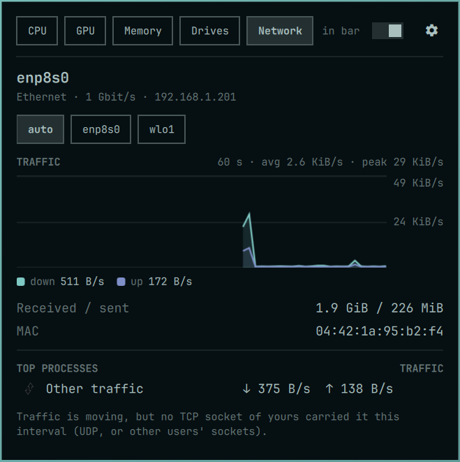

# Quadrant

<p align="center">
  
</p>
<p align="center"><em>Same plugin, three themes — Quadrant follows the active Omarchy palette.</em></p>

A unified system monitor for the Omarchy Quattro bar: CPU, GPU, memory,
drives and network in one compact bar slot and one tabbed panel. Every
tab names the hardware it measures — CPU model and topology, GPU marketing
name and driver, usable RAM and DIMM kit, block devices and mounts, the
interface's link speed and addresses — then shows live usage, the last
minute or the last hour of history, and the processes behind the numbers.

<p align="center">
  
</p>

<p align="center">
  
  
</p>
<p align="center">
  
  
</p>
<p align="center">
  
</p>

Built against the documented Quattro plugin contract. Supports **Omarchy
4.0.3 and later** (the shell's plugin service and settings APIs). Requires
`bash` ≥ 5, `jq`, `python3`, `ss` and `ip` (iproute2), `df` (coreutils),
and `awk` (mawk or gawk); `nvidia-smi` only if you have an NVIDIA card;
`lspci` (pciutils) is optional and used to name AMD/Intel GPUs.

## Install

Quadrant is a third-party plugin and runs unsandboxed with your user
permissions. Review the repository before enabling it.

### From the Omarchy menu

1. Open the Omarchy menu.
2. Choose **Setup → Plugins → Add**.
3. Enter:

   ```text
   https://github.com/BVisagie/omarchy-quadrant.git
   ```

4. Read and accept Omarchy's plugin warning, then choose whether to enable
   Quadrant.

### From a terminal

```sh
omarchy plugin add https://github.com/BVisagie/omarchy-quadrant.git
```

Without `--enable`, Omarchy asks whether to enable the plugin after cloning
and validating it. Choosing no lets you inspect the installed checkout at
`~/.config/omarchy/plugins/dev.bvisagie.quadrant/` first. Enable it later
with:

```sh
omarchy plugin enable dev.bvisagie.quadrant
```

The widget starts in the right bar section (`barWidget.defaultSection`).
Move it with `omarchy bar move dev.bvisagie.quadrant --section center`.

### Update

```sh
omarchy plugin update dev.bvisagie.quadrant
```

Omarchy shows the incoming diff, validates the revision, and only then
fast-forwards the installed checkout.

### Uninstall

From the Omarchy menu, choose **Setup → Plugins → Remove**, then select
**Quadrant**. Or from a terminal:

```sh
omarchy plugin remove dev.bvisagie.quadrant
```

Omarchy disables Quadrant before removing its git checkout. Quadrant keeps
one state file, `~/.local/state/dev.bvisagie.quadrant/history.json`
(the last hour of graph history); delete it if you want nothing left
behind. No sudo or pkexec is involved at any point.

## Usage

### Bar

- **Segments**: CPU, GPU, memory, drives and network each pair a Nerd Font
  glyph (or `C`/`G`/`M`/`D`/`N` with `barLabels letter`) with a live value.
  Network shows compact `↑`/`↓` rates. Vertical bars stack the segments
  and drop the glyphs. Each segment toggles independently from its tab's
  **in bar** switch or the settings view; unchecking every segment leaves a
  compact system-monitor glyph.
- **Click a segment** to open its tab (or close the panel when that tab is
  already showing); click elsewhere in the slot to toggle the panel on the
  last-used tab. **Right-click** opens btop. **Scroll** over the slot to
  switch tabs while the panel is open. Hovering a segment shows its tooltip.
- **GPU** is dedicated cards only; integrated graphics live on the CPU tab.
  When no dedicated card is detected the GPU slot shows **Drives** instead
  (`diskFallbackWithoutGpu`). A separate drives segment is off by default.
- **Colour** (`barPalette`): `theme` paints a value in the theme's urgent
  colour at 90 % and keeps it there until it drops below 80 % (no flicker
  on the line); `heat` ramps every value from muted through accent to
  urgent; `vivid` keeps one fixed hue per metric.

### Panel

Every tab reads the same way: identity, a graph with its average and
peak, stats, then the top processes.

| Key | Action |
| --- | --- |
| `←` `→` or `1`–`N` | switch tab (`N` = visible tabs; GPU is omitted without a dedicated card) |
| `↑` `↓` | move the cursor through the process rows (hover does the same; the row's tooltip shows the pid and a detail) |
| `H` | every graph: last hour ↔ last minute (clicking the graph header or scrolling over the graph does the same) |
| `S` | settings view (gear in the header) |
| `R` | re-read hardware identity and refresh the tab |
| `Esc` | close settings, then the panel |
| `Tab` | keeps its Quattro meaning: switch to the adjacent bar panel |

Process lists: click the column heading to cycle between the sticky roster
order, by value, and by name. Each row carries a sparkline of its last
thirty samples.

### IPC

```sh
quickshell ipc -p "$OMARCHY_PATH/shell" call dev.bvisagie.quadrant showTab gpu     # cpu | gpu | mem | disk | net
quickshell ipc -p "$OMARCHY_PATH/shell" call dev.bvisagie.quadrant settings
quickshell ipc -p "$OMARCHY_PATH/shell" call dev.bvisagie.quadrant setBarSegment disk true
quickshell ipc -p "$OMARCHY_PATH/shell" call dev.bvisagie.quadrant set processCount 8
omarchy-shell shell summon dev.bvisagie.quadrant '{}'   # open on last-used tab
omarchy-shell shell hide dev.bvisagie.quadrant
```

## Settings

Settings live inline on the widget's entry in `~/.config/omarchy/shell.json`
and are declared in the manifest schema. The settings view writes them
through the shell, typed; `omarchy bar set` works too and takes effect at
once:

```sh
omarchy bar set dev.bvisagie.quadrant processCount 8 --json
omarchy bar set dev.bvisagie.quadrant networkInterface '"wg0"' --json
```

Entries written by earlier versions (quoted strings, stringified lists)
are still read correctly and are rewritten in the typed form the first
time any setting is saved.

| Key | Default | Meaning |
| --- | --- | --- |
| `segments` | `["cpu","gpu","memory","network"]` | Bar segments to show; any subset of `cpu gpu memory disk network`. An empty list keeps a compact icon. |
| `processCount` | `5` | Top-process rows per tab (1–10) |
| `barIntervalMs` | `1000` | Stream cadence feeding the bar and the graphs (250–60000) |
| `panelIntervalMs` | `2000` | On-demand sampler cadence while the panel is open (500–60000) |
| `networkInterface` | `"auto"` | `auto` = default route across IPv4 **and** IPv6, lowest metric wins, IPv4 takes ties |
| `gpuDevice` | `"auto"` | Dedicated card for the GPU segment and tab: boot display card among dedicated GPUs, else `card0`; or a specific `cardN` |
| `integratedGpuDevice` | `"auto"` | Which card is integrated graphics: `auto` (Intel at `00:02.x` or a known AMD APU), `none`, or a `cardN` |
| `diskFallbackWithoutGpu` | `true` | Show Drives in the GPU slot when no dedicated card is detected |
| `diskDevice` | `"auto"` | `auto` = physical disk backing `/` (LUKS/LVM folded), else the largest; or a sysfs name such as `nvme0n1` |
| `barPalette` | `"theme"` | `theme`, `heat`, or `vivid` (see Bar) |
| `barLabels` | `"glyph"` | `glyph`, `letter`, or `none` |
| `rateUnit` | `"bytes"` | Network rates in `bytes` (KiB/s, binary) or `bits` (Mb/s, decimal) |

## What it measures (and what it does not)

- **CPU**: user (incl. nice) and system (incl. irq/softirq) are stacked in
  the graph; `iowait` is its own series; `steal` is stacked and labeled
  only when non-zero. The bar percentage is non-idle time, so a disk-bound
  machine is not shown as idle. Topology comes from sysfs (online cores
  keyed by package and core id, Intel `cpu_core`/`cpu_atom` lists,
  otherwise capacity/max-frequency clusters). The core grid collapses SMT
  siblings and keys per-core load by cpu id, so offline cores never shift
  the picture. Package frequency is the mean of every cpufreq policy.
  Pressure is PSI `cpu` some/full avg10. Top processes use interval CPU
  from `/proc/<pid>/stat`, keyed by pid **and** start time so a reused pid
  never inherits counters, expressed as a share of the whole machine (the
  tooltip shows the one-core figure). Interpreters are named after their
  script (`worker.py`, not `python3`); wrapper binaries (`electron`,
  `chrome`) are labeled from a fixed map; same-name rows are summed.
- **Memory**: the ring and the bar both show used = `(MemTotal −
  MemAvailable) / MemTotal`. Composition (Applications / Kernel
  unreclaimable slab / Cache = page cache + Buffers + SReclaimable / Free)
  is a stacked bar. The pressure ring is PSI memory `some avg10` on a
  0–25 % scale (a 0–100 ring never moves). The used-memory graph is framed
  on its own range so a flat line still shows its movement. Process rows
  use proportional set size from `smaps_rollup` where readable (shared
  pages counted once) and say so; otherwise RSS. DIMM identity comes from
  unprivileged udev DMI; swap devices from `/proc/swaps`.
- **GPU**: dedicated cards only. AMD reads `amdgpu` sysfs (busy, memory
  busy, per-engine busy, VRAM, hwmon edge and junction temperature, power,
  active DPM clock). NVIDIA runs `nvidia-smi` (timeout-bounded) only while
  the GPU segment or tab is visible, never in the 1 Hz stream. Intel uses
  DRM fdinfo engine time for busy %, with RC6 / xe `gtidle` residency of
  **that card** as fallback, and labels a frequency ratio `~` until a DRM
  sample arrives. Multi-engine capacity is honoured, so two video decoders
  read 0–100 %. Per-process rows come from DRM fdinfo per client (busy
  share and resident memory; a file shared across fork is counted once) on
  AMD and Intel, and from `nvidia-smi --query-compute-apps` (memory only)
  on NVIDIA. Multi-GPU systems get a card picker that shows model names.
- **Drives**: `/proc/diskstats` for whole block devices, excluding
  `loop*`, `ram*`, `zram*`, `fd*`, `nbd*`, `sr*`. Device-mapper and md RAID
  with a single physical parent are folded onto it (LUKS root shows as
  `nvme0n1`); RAID across two disks stays selectable as `md0`. Busy % is
  `io_ticks` over wall time. Mounts come from `df -P -B1 -T`, bind mounts
  collapse to the shortest path, and only mounts on the selected disk are
  listed, each with a usage bar. NVMe temperature is the `nvme` hwmon only.
  Per-process I/O is read from `/proc/<pid>/io`, which the kernel exposes
  only for processes you own — the list says how many it could not read.
- **Network**: rates for the selected interface, received/sent totals, link
  speed, type (Ethernet, Wi-Fi, virtual), MAC and global addresses from
  one `ip -j addr` run at startup and on R. Per-process attribution uses
  per-socket TCP byte counters from `ss -tinp`, scoped to the interface's
  addresses. UDP, other users' sockets, and closed-socket remainders are an
  honest **Other traffic** row (keyed on `pid == 0`). The interface picker
  pins `networkInterface`; `auto` follows the default route.
- **History**: every graph keeps 60 s at the stream cadence and one hour of
  10 s mean buckets. The hour survives a shell restart (see Security
  posture). Gaps — sleep, a restart — are drawn as gaps, never as a slope.
- **Temperature**: hwmon whitelist only (`k10temp`, `coretemp`, `zenpower`,
  `cpu_thermal` for the CPU; `nvme` for drives). Quadrant shows `--` rather
  than another chip's temperature.

## Security posture

Quadrant runs **unsandboxed inside `omarchy-shell` with your user
permissions** — the same model as every Quattro plugin. Concretely:

- **Read-only.** The plugin sends no signals to other processes. It writes
  one file, `~/.local/state/dev.bvisagie.quadrant/history.json` (graph
  history, atomic writes, validated on load), plus a FIFO under a
  `mktemp -d` directory in `$XDG_RUNTIME_DIR` that is the sampler's tick
  clock and is removed on exit (stale ones from a killed sampler are swept
  at the next start). Settings are written through the shell's own
  `shell.json` writer. Right-click launches `btop` through
  `omarchy-launch-or-focus-tui` with a fixed argv; that is the only
  process the plugin starts for you.
- **No secrets in process data.** Process lists read `/proc/<pid>/comm`,
  `stat`, `statm`, `io` and `smaps_rollup`. `/proc/<pid>/cmdline` and the
  `exe` link are read only for the rows that can show, as a clipped token
  list against a fixed app map (so `electron` can be labeled Brave and
  `python3 worker.py` can be labeled `worker.py`); they are never rendered.
  `environ` is never read.
- **Injection-safe rendering.** Every `Text` element bound to script output
  or process names sets `textFormat: Text.PlainText`. CI enforces this over
  every QML file.
- **Safe transport.** Process names, firmware strings, PCI-DB names and raw
  tool output travel as JSON strings built with `jq --arg` — never through a
  shell. The `ss` parser anchors on the kernel's trailing `pid=` field, so a
  forged process name cannot borrow another pid.
- **Exact-match icons.** Desktop-entry matching for process icons and names
  is exact-match only; the cache is bounded.
- **Failures are visible.** A helper that exits non-zero or times out
  surfaces an error in the panel — never an empty list presented as "no
  activity".
- **Hardened scripts.** `set -euo pipefail`, helpers resolved from
  `/usr/bin/<name>` first, quoted expansions, POSIX awk only (CI runs the
  suite under mawk **and** gawk), a fork-count test on the stream.
- **Binaries invoked**: `bash`, `jq`, `python3`, `ss`, `ip`, `df`, `mkdir`,
  `timeout`, `mktemp`, `mkfifo`, `nvidia-smi` (NVIDIA only, on demand),
  `lspci` (optional, at startup / on R), `omarchy-launch-or-focus-tui`
  (right-click only). No root, no setcap, no setuid, no daemons, no
  systemd units, nothing downloaded.

### Data layer

The plugin declares a **service**: the shell creates one `components/Store.qml`
per shell, and each bar widget copy (one per monitor) binds to it. So
there is one long-lived sampler, one set of pollers and one history,
however many screens you have.

`scripts/quadrant-stream` emits one JSON line per tick (CPU ticks and
per-core ticks keyed by cpu id, meminfo, PSI, swap counters, per-interface
and per-disk counters, default routes, whitelisted CPU temperature, cheap
GPU sysfs fields for a dedicated AMD/Intel card). It is **a single bash
process with zero fork/exec per tick** — timing comes from `read -t` on a
self-held FIFO, JSON escaping writes through `printf -v`, and
`tests/stream-forks.sh` proves it by watching the process's waited-for-
children counters stay flat. The stream ships raw counters only; every
delta and rate is a pure function under `lib/` (ES modules shared by
Quickshell and node).

On-demand helpers run only while someone is looking: `process-sample`
(one `/proc` walk for CPU, memory and I/O rows) while a CPU, Memory or
Drives tab is open; `process-net` while a Network tab is open; `gpu-stats`
(with `gpu-drm` for fdinfo) while a GPU segment or tab needs it; `disk-info
usage` (df and NVMe temperatures) while a Drives tab is open. Identity
(`system-info`, `disk-info`, `gpu-stats list`) runs at startup and on R.

## Development

```sh
node --test tests/lib/*.test.js                 # pure-logic tests, one file per lib module
python3 -m unittest discover -s tests/py -t .   # python helpers against fake /proc and /sys trees
bash tests/stream-forks.sh                      # the stream forks nothing on the tick path
bash tests/qs-smoke.sh                          # the store, headless under a throwaway quickshell
bash tests/render.sh cpu /tmp/cpu.png           # render one tab offscreen (cpu gpu mem disk net settings)
bash tests/qmllint.sh                           # qmllint with the shell's qs.* imports resolved
shellcheck -x scripts/quadrant-stream scripts/system-info scripts/disk-info scripts/gpu-stats scripts/process-sample scripts/process-net tests/*.sh
gawk -f tests/check-plaintext.awk $(find . -path ./.git -prune -o -path ./tests/qs -prune -o -name '*.qml' -print)
```

CI runs the node, python, shell and awk checks on every push; the
quickshell-based checks run wherever quickshell and an Omarchy shell are
present and skip elsewhere.

Pre-publish gate (needs an Omarchy install):

```sh
omarchy plugin validate /path/to/omarchy-quadrant
bash tests/qmllint.sh
```

Manual test matrix before publishing: AMD / NVIDIA / Intel dedicated,
Intel or AMD iGPU-only, hybrid iGPU+dGPU, no-GPU, IPv6-only network,
swapless machine, vertical bar, light theme, two monitors (one
`quadrant-stream` process in total), both mawk and gawk as `awk`,
spinning disk and multi-filesystem machines.

## License

MIT — see [LICENSE](LICENSE).
