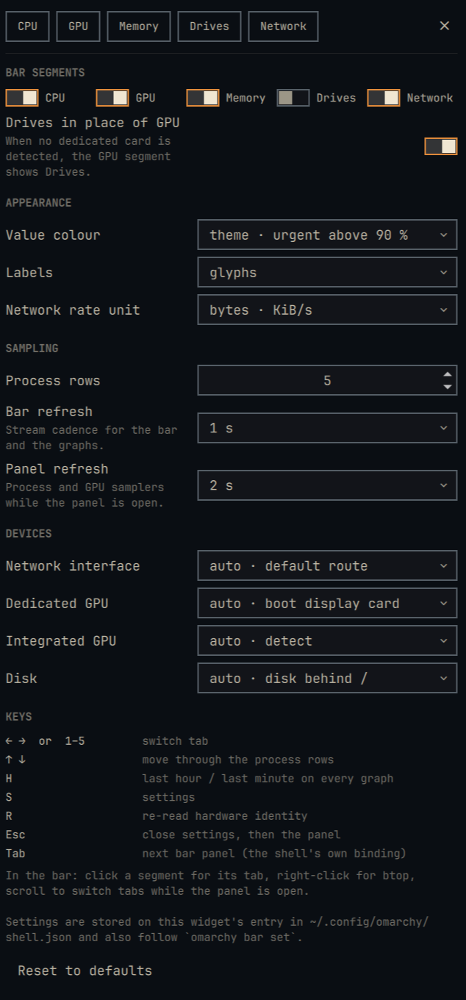

# Settings

[← README](../README.md)

Open settings with the panel's gear or `S`. Changes apply immediately.

Settings live inline on the widget's entry in `~/.config/omarchy/shell.json`
and are declared in the manifest schema. The settings view writes them
through the shell, typed; `omarchy bar set` works too and takes effect at
once:

```sh
omarchy bar set dev.bvisagie.quadrant processCount 8 --json
omarchy bar set dev.bvisagie.quadrant networkInterface '"wg0"' --json
```

Entries written by earlier versions (quoted strings, stringified lists)
are still read correctly and are rewritten in the typed form the first
time any setting is saved.

| Key | Default | Meaning |
| --- | --- | --- |
| `segments` | `["cpu","gpu","memory","network"]` | Bar segments to show; any subset of `cpu gpu memory disk network`. An empty list keeps a compact icon. |
| `processCount` | `5` | Top-process rows per tab (1–10) |
| `barIntervalMs` | `1000` | Stream cadence feeding the bar and the graphs (250–60000) |
| `panelIntervalMs` | `2000` | On-demand helper cadence (500–60000), including GPU polling for a visible bar segment |
| `networkInterface` | `"auto"` | `auto` = default route across IPv4 **and** IPv6, lowest metric wins, IPv4 takes ties; without a default route, the first non-loopback interface |
| `gpuDevice` | `"auto"` | Dedicated card for the GPU segment and tab: boot display card among detected dedicated GPUs, else `card0`, else the first detected dedicated card; or a specific `cardN` |
| `integratedGpuDevice` | `"auto"` | Which card is integrated graphics: `auto` (Intel at `00:02.x` or a known AMD APU), `none` (treat all cards as dedicated), or a `cardN` (force that card to be integrated) |
| `diskFallbackWithoutGpu` | `true` | Show Drives in the GPU slot when no dedicated card is detected |
| `diskDevice` | `"auto"` | `auto` = physical disk backing `/` (LUKS/LVM folded), else the largest; or a sysfs name such as `nvme0n1` |
| `barPalette` | `"theme"` | `theme`, `heat`, or `vivid` (see [Bar](USAGE.md#bar)) |
| `barLabels` | `"glyph"` | `glyph`, `letter`, or `none` |
| `rateUnit` | `"bytes"` | Network panel and tooltip rates in `bytes` (KiB/s, binary) or `bits` (Mb/s, decimal); compact bar rates stay in bytes |

Every value is validated on read, whatever wrote it: numbers are clamped
to the ranges above, enumerations fall back to their default, device names
must look like a device (an interface name of at most 15 characters, a
`cardN`, a sysfs block name) or they become `auto`, unknown segment names
are dropped. Quadrant's settings view and IPC may only update the keys
listed here.
Unknown keys already present in the entry are preserved; settings at their
defaults are omitted when Quadrant saves. The helper scripts check their arguments again before touching anything.

## Device selection and bar fallback

The tab pickers persist a specific device. Choose `auto` in settings to
return to automatic GPU or disk selection; the Network tab also offers
`auto`. Valid names for absent dedicated GPUs, disks, and interfaces
remain pinned and produce a warning rather than selecting another device. Invalid names
fall back to `auto`; `lo` is excluded from interface selection.

Without a dedicated GPU, `diskFallbackWithoutGpu` replaces a configured
`gpu` token with Drives for display without rewriting `segments`. The
Drives tab's **in bar** switch controls that fallback in this case. It
also removes an explicit `disk` segment when switched off. To restore a
fallback segment, the configured list must still contain `gpu`.

Changing the selected interface, disk, or dedicated GPU clears that
metric's graph history so the graph does not combine different devices.

## CLI examples

```sh
omarchy bar set dev.bvisagie.quadrant segments '["cpu","memory","network"]' --json
omarchy bar set dev.bvisagie.quadrant barPalette '"heat"' --json
omarchy bar set dev.bvisagie.quadrant rateUnit '"bits"' --json
omarchy bar set dev.bvisagie.quadrant diskFallbackWithoutGpu false --json
```

Use `--json` for typed numbers, booleans, lists, and JSON-quoted strings.
See [IPC](USAGE.md#ipc) for the plugin's own `set` and `setBarSegment`
methods.

## Settings view

The settings view groups bar segments, appearance, sampling, and devices,
with keyboard help and a **Reset to defaults** action at the bottom.

<details>
  <summary>Show the full settings screenshot</summary>
  <p align="center">
    <a href="screenshots/settings.png"></a>
  </p>
</details>
